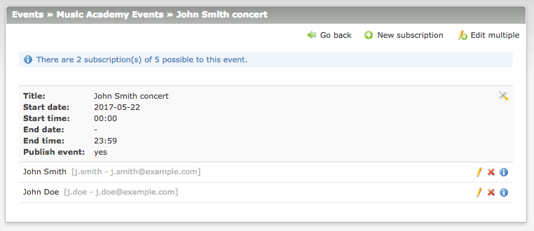

# Events Subscriptions extension for Contao Open Source CMS

Events Subscriptions is an extension for the [Contao Open Source CMS](https://contao.org).

Contao extension that allows members of your website to subscribe to the events. In the backend there is an overview 
of members subscribed to each event. Front end comes up with several frontend modules. You can also setup a reminder 
for members subscribed to the events that will be sent a certain amount of days before event takes place!

## Documentation

1. [Installation](docs/01-installation.md)
2. [Basic configuration](docs/02-basics.md)
3. [Advanced configuration](docs/03-advanced.md)
4. [Backend interface](docs/04-backend.md)
5. [Frontend modules](docs/05-frontend-modules.md)
6. [Notifications](docs/06-notifications.md)
7. [Insert tags](docs/07-insert-tags.md)
8. [Developers](docs/08-developers.md)

## Copyright

This project has been created and is maintained by [Codefog](https://codefog.pl).
