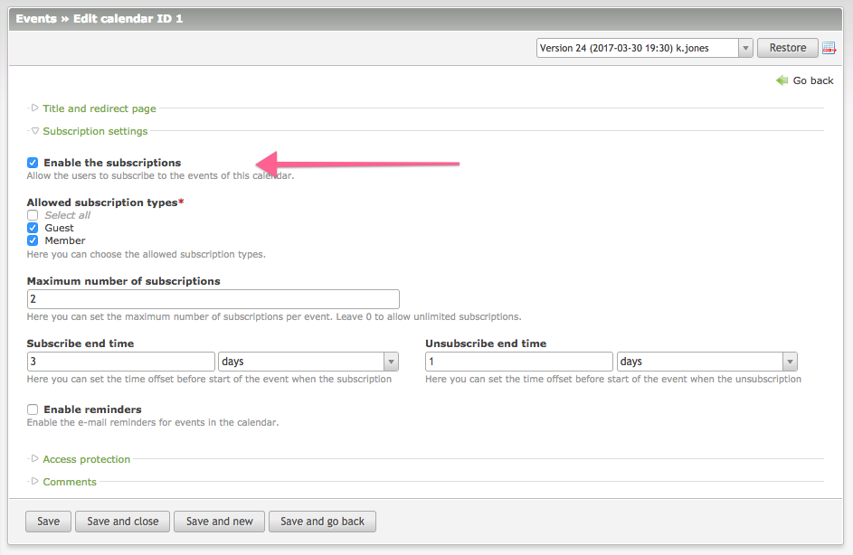
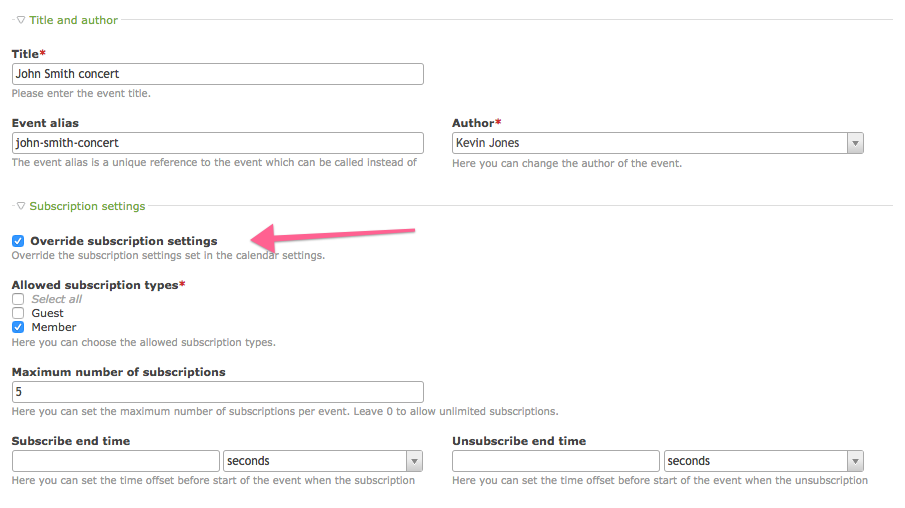

# Basic configuration – Events Subscriptions

1. [Installation](01-installation.md)
2. [**Basic configuration**](02-basics.md)
3. [Advanced configuration](03-advanced.md)
4. [Backend interface](04-backend.md)
5. [Frontend modules](05-frontend-modules.md)
6. [Notifications](06-notifications.md)
7. [Insert tags](07-insert-tags.md)
8. [Developers](08-developers.md)

## Enabling the subscriptions

You can enable the subscriptions individually per each calendar. To do that simply go to the calendar
settings and check the appropriate box under the `Subscription settings` legend:

Here you can also configure the default subscription settings for all events in this calendar. The
details on every setting is describes in the [Advanced configuration](03-advanced.md) section
of the documentation.
 
> It is still possible to override each setting individually per event (see below)!

Once the subscriptions are enabled you should see the new button in the event list view in the backend:
 

## Overriding the settings per event

As stated before the default calendar settings can be overridden individually by each event.
In order to do that, simply enable the box `Override subscription settings` in the event settings:

