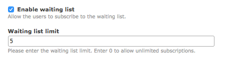
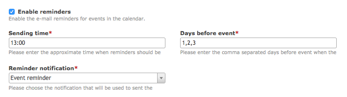
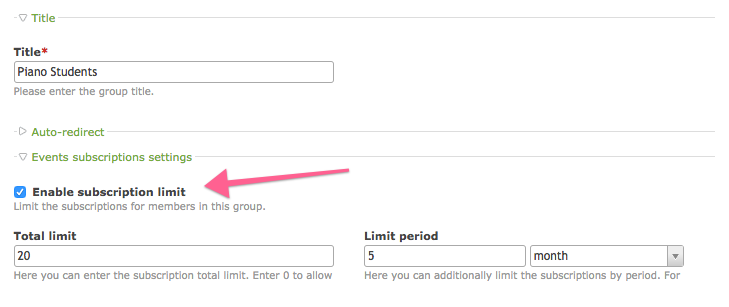

# Advanced configuration – Events Subscriptions

1. [Installation](01-installation.md)
2. [Basic configuration](02-basics.md)
3. [**Advanced configuration**](03-advanced.md)
4. [Backend interface](04-backend.md)
5. [Frontend modules](05-frontend-modules.md)
6. [Notifications](06-notifications.md)
7. [Insert tags](07-insert-tags.md)
8. [Developers](08-developers.md)

## Advanced settings

> All the settings below that limit the subscriptions are only applicable for the frontend.
> Backend users are not affected by any of those limits.

### Maximum number of subscriptions

Here you can set the maximum number of subscriptions per each event. For example if you set it to 5
then only 5 members will be able to subscribe to the event. For unlimited subscriptions simply enter 0.

### Subscribe end time

Here you can set the time offset before the event starts when to stop users to subscribe.
For example if the event starts on `10-03-2017` and you set the subscribe end time to `3 days`,
it will no longer be possible to subscribe on `07-03-2017` and after.

### Unsubscribe end time

Here you can set the time offset before the event starts when to stop users to unsubscribe.
For example if the event starts on `10-03-2017` and you set the unsubscribe end time to `3 days`,
it will no longer be possible to unsubscribe on `07-03-2017` and after.

## Waiting list

Sometimes you may want to limit the maximum number of subscriptions but still allow the users to subscribe
in order to move up in the queue when the existing subscriber resigns. This is the case where the waiting
list feature comes in handy. You can enable it by checking the appropriate box and entering the maximum
number of participants on the waiting list. Leave 0 to not limit the waiting list at all.

## Subscription reminders

To make sure your members will not forget about the event you can set the subscription reminders
that will be sent on specific days before the event starts. Take a look at the configuration below: 

The reminders will be sent at 13:00 on 1st, 2nd and 3rd day before the event starts. For example
if the event starts on `10-03-2017`, the reminders will be sent at: 
`07-03-2017 13:00`, `08-03-2017 13:00`, `09-03-2017 13:00`.

Additionally you have to create and specify the reminder notification in the Notification Center. 

> In order to make reminders work with no problems make sure that Contao cron is executed 
> at least upon the sending time! The recommended way it to set the cron to be run every minute.

## Limit subscriptions per member and/or member group

It is also possible to limit the amount of possible subscriptions per member and per member group.
You can enable that in the member group and/or member settings:

> All settings set in the member group can be overridden per each member individually. 

### Total limit

Here you can set the maximum number of events a member can subscribe to. For unlimited subscriptions
simply enter 0.

> If member is assigned to multiple groups, the highest limit value will be found and used.

### Limit period

Here you can set the maximum number of events a member can subscribe to for a given period. For unlimited
subscriptions simply enter no value at all.

As an example, if the limit is set to 3 events per month and the user is already subscribed for
3 events that take place in January, he won't be able to subscribe to another one that takes place
in the same month. However he will be able to subscribe to the event that takes place in another 
month, e.g. February.

> If member is assigned to multiple groups, the limit value of the first member group will be used.
