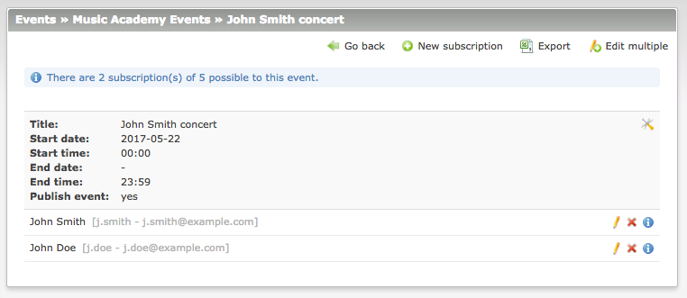
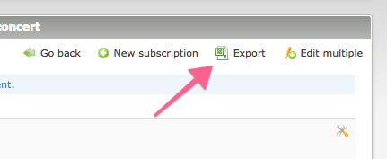

# Backend interface – Events Subscriptions

1. [Installation](01-installation.md)
2. [Basic configuration](02-basics.md)
3. [Advanced configuration](03-advanced.md)
4. [**Backend interface**](04-backend.md)
5. [Frontend modules](05-frontend-modules.md)
6. [Notifications](06-notifications.md)
7. [Insert tags](07-insert-tags.md)
8. [Developers](08-developers.md)

## Event list view

After enabling the subscriptions in the calendar settings each event gains a new button. It leads
to the view of subscription list of that event. 

## Subscription list view

The subscription list view allows you to create, manage and delete the records. At the top of the view
there is also displayed an information about the total number of subscription to this event as well as
the note about limit, if any.

### Export subscriptions

The subscriptions of each event can be exported to the CSV or Excel file. Fore more information on how to alter 
the exported data please check the [Developers](08-developers.md) section.

> To export data in Excel format you have to install the [phpoffice/phpspreadsheet](https://packagist.org/packages/phpoffice/phpspreadsheet) package. 

